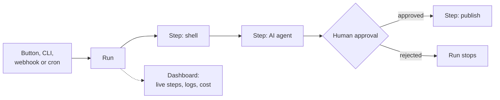

<div align="center">

<picture>
  <source media="(prefers-color-scheme: dark)" srcset="design/logo/ironflow-logo-dark.svg">
  <source media="(prefers-color-scheme: light)" srcset="design/logo/ironflow-logo-light.svg">
  
</picture>

[](https://gitlab.com/ThomasTartrau/ironflow/-/pipelines)
[](https://crates.io/crates/ironflow-core)
[](LICENSE)

**Write your automations in Rust. Ironflow runs them, remembers every step,<br>
keeps AI agents on a budget, and waits for a human "yes" when you ask it to.**

[Documentation](https://ironflow-023e1b.gitlab.io/) •
[Try it in 5 minutes](#try-it-in-5-minutes) •
[Examples](examples/ironflow-workflows/src)

</div>

---

## What is it for?

You have a task made of several steps: run a command, call an API, ask an AI to write
something, wait for a colleague to check it, then publish. Today it lives in a shell
script, a CI job, or someone's head.

With Ironflow you write that task once, as a normal Rust function. Then you start it from a
button, a command, a webhook or a timer, and Ironflow:

- **runs each step** and writes down what happened: output, duration, cost;
- **pauses** when a human has to approve, and picks up where it stopped once they click;
- **caps what AI agents spend**, step by step;
- **shows everything live** in a web dashboard, so you see which step is running and why one
  failed.



Things people build with it:

- **AI code review**: a merge request opens, an agent reviews the diff, comments are posted back.
- **Deploy with a gate**: build and test, then wait for a release manager before production.
- **Alert to fix**: an error alert arrives, an agent proposes a patch, the tests run, a merge
  request is opened for a human to read.

## What a workflow looks like

A workflow is a Rust type with one async function. Each `ctx.*` call is a step that Ironflow
records. There is no YAML and no special language: `if`, `for`, `match` and `?` work as usual.

```rust,no_run
use ironflow_engine::config::{AgentStepConfig, ApprovalConfig, ShellConfig};
use ironflow_engine::context::WorkflowContext;
use ironflow_engine::handler::{HandlerFuture, WorkflowHandler};

struct ReleaseNotes;

impl WorkflowHandler for ReleaseNotes {
    fn name(&self) -> &str {
        "release-notes"
    }

    fn execute<'a>(&'a self, ctx: &'a mut WorkflowContext) -> HandlerFuture<'a> {
        Box::pin(async move {
            // 1. Run a command.
            let commits = ctx
                .shell("commits", ShellConfig::new("git log --oneline v1.0..HEAD"))
                .await?;

            // 2. Ask an AI agent, with a spending cap.
            let prompt = format!("Write release notes for:\n{}", commits.stdout());
            let notes = ctx
                .agent("write-notes", AgentStepConfig::new(&prompt).max_budget_usd(0.50))
                .await?;

            // 3. Stop here until a human approves in the dashboard, the CLI or the API.
            ctx.approval("review", ApprovalConfig::new("Publish these release notes?"))
                .await?;

            // 4. Publish. The agent text is passed as an argument, never parsed by a shell.
            ctx.shell("publish", ShellConfig::exec("./publish.sh", &[notes.text()]))
                .await?;
            Ok(())
        })
    }
}
```

## Try it in 5 minutes

You need [Rust 1.94+](https://rustup.rs), [Node 22+ with pnpm](https://pnpm.io/installation)
for the dashboard, and, for agent steps, the
[Claude Code CLI](https://docs.claude.com/en/docs/claude-code).

```bash
git clone https://gitlab.com/ThomasTartrau/ironflow.git
cd ironflow
(cd ironflow-dashboard && pnpm install && pnpm build)
```

Start the server. It hosts the API and the dashboard on <http://localhost:3000> and comes with a
dozen example workflows:

```bash
IRONFLOW_ENV=development cargo run -p ironflow-example-server
```

In a second terminal, start a worker: the process that actually runs the steps. Copy the token
the server printed (`start workers with WORKER_TOKEN=...`):

```bash
WORKER_TOKEN=<token from the server> cargo run -p ironflow-example-worker
```

Open <http://localhost:3000>, create an account, pick **deploy-approval** and click **Run**.
Watch the steps go by, then approve the gate. Runs are kept in memory, so they disappear when the
server stops; the [Quick Start](https://ironflow-023e1b.gitlab.io/getting-started/quick-start.html)
shows the next steps (CLI, Postgres, your own workflow).

> **Using Claude Code?** Install the [Ironflow plugin](plugins/ironflow/README.md) and run
> `/ironflow setup`: it scaffolds a project with a server, a worker, a first workflow and its test.

## Is Ironflow for you?

| Good fit | Not a good fit |
|---|---|
| You write Rust, or are happy to | You want to draw workflows without code |
| Your steps mix commands, HTTP calls and AI agents | You only need a cron job that runs one script |
| You need a human to approve some steps | You need a hosted service: Ironflow is self-hosted |
| You want to see the cost of every AI call | |

Workflows are written in Rust, but anything can start them: the dashboard, the
[CLI](https://ironflow-023e1b.gitlab.io/reference/interfaces.html#cli), the REST API, a
webhook, a cron schedule, or an AI assistant through the MCP server.

## Learn more

| I want to... | Read |
|---|---|
| Run the demo, then my own project | [Quick Start](https://ironflow-023e1b.gitlab.io/getting-started/quick-start.html) |
| Write my first workflow | [Writing a Workflow](https://ironflow-023e1b.gitlab.io/guides/writing-a-workflow.html) |
| Know every kind of step | [Steps](https://ironflow-023e1b.gitlab.io/concepts/steps.html) |
| Use OpenAI, Gemini, Mistral or a remote Claude | [Agent Providers](https://ironflow-023e1b.gitlab.io/guides/agent-providers.html) |
| Use the building blocks without a server | [Library Mode](https://ironflow-023e1b.gitlab.io/guides/library-mode.html) |
| Drive Ironflow from a terminal, Rust code or an AI assistant | [Interfaces](https://ironflow-023e1b.gitlab.io/reference/interfaces.html) |
| Deploy and configure it | [Running the Server](https://ironflow-023e1b.gitlab.io/getting-started/server.html) |
| Understand how it is built | [Architecture](https://ironflow-023e1b.gitlab.io/architecture/overview.html) |

API reference for every crate is on [docs.rs](https://docs.rs/ironflow-engine).
To work on Ironflow itself, see [CONTRIBUTING.md](CONTRIBUTING.md).

## License

MIT - see [LICENSE](LICENSE).
