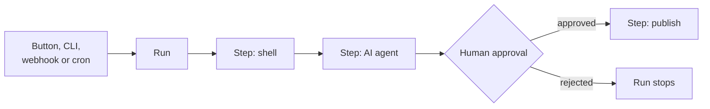

# Ironflow

Ironflow runs automations written in Rust. A workflow is a list of steps (a shell command,
an HTTP call, an AI agent, a human approval) written as a normal async function. Ironflow runs
each step, records its output, duration and cost, pauses when a human has to decide, and shows
everything live in a web dashboard.

## Words used in this book

| Word | Meaning |
|------|---------|
| **Workflow** | The Rust code describing what to do, a type implementing `WorkflowHandler` |
| **Run** | One execution of a workflow, stored with its status and cost |
| **Step** | One action inside a run: `ctx.shell()`, `ctx.agent()`, `ctx.approval()`... |
| **API server** | Stores runs, serves the REST API and the dashboard. It does not execute steps |
| **Worker** | The process that picks pending runs and executes their steps |
| **Provider** | Where an AI agent step runs: Claude Code, OpenAI, Gemini... |

## Where to start

- **New here?** [Quick Start](getting-started/quick-start.md): run the demo in five minutes.
- **Ready to write code?** [Writing a Workflow](guides/writing-a-workflow.md).
- **Looking up how something works?** The [Concepts](concepts/workflow-handler.md) pages.
- **Driving Ironflow from a terminal or an AI assistant?** [Interfaces](reference/interfaces.md).
- **Deploying it?** [Running the Server](getting-started/server.md) and
  [Running a Worker](getting-started/worker.md).
- **Curious about the internals?** [Architecture](architecture/overview.md).

The API reference of every crate is on [docs.rs](https://docs.rs/ironflow-engine).
