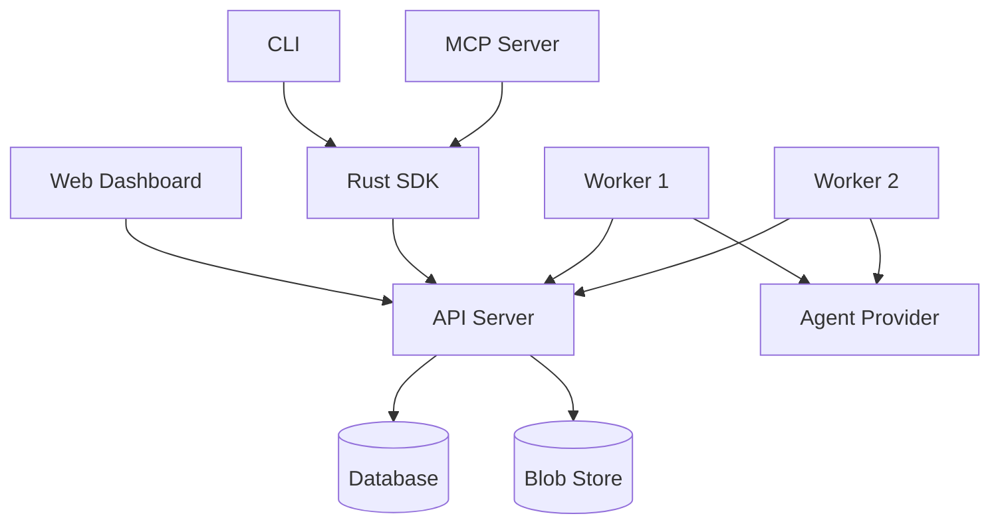

# Architecture Overview

Ironflow follows a client-server architecture with background workers for execution.

## Components

## Crate map

| Crate | Role |
|-------|------|
| `ironflow-core` | Shell execution, agent providers, cost tracking |
| `ironflow-engine` | Workflow handler trait, context, step orchestration |
| `ironflow-api` | REST API (axum), routes, SSE events, dashboard serving |
| `ironflow-worker` | Background worker that polls and executes runs |
| `ironflow-store` | Storage trait + PostgreSQL and in-memory backends |
| `ironflow-auth` | JWT authentication, password hashing, API keys |
| `ironflow-runtime` | Daemon features: webhooks, trigger sources |
| `ironflow-artifacts` | Blob storage for step-produced files |
| `ironflow-templates` | Fetch and install workflow templates from Git |
| `ironflow-sdk` | Type-safe Rust client (types generated from OpenAPI) |
| `ironflow-cli` | Command-line interface (clap v4) |
| `ironflow-mcp` | Model Context Protocol server |
| `ironflow-types` | Shared API envelope types |

## Request flow

1. A client (dashboard, CLI, SDK, or webhook) sends a request to the API
2. The API validates authentication, creates a Run in the Store, and returns it
3. A Worker polls the API, acquires a lease on the Run, and executes the handler
4. The handler calls steps (`ctx.shell()`, `ctx.agent()`, etc.), each persisted as they complete
5. Events are published via SSE for real-time updates
6. On completion or failure, the Worker reports the result back to the API

## Data flow

Runs and steps are stored in PostgreSQL (or in-memory for development). Artifacts (files produced by steps) are stored in a separate blob store (local filesystem by default). The two are linked by artifact metadata on each step.
