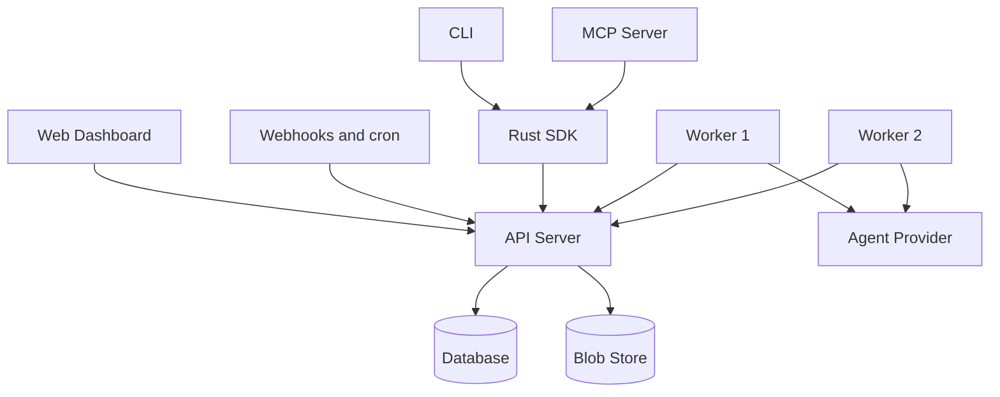

# Architecture Overview

Ironflow follows a client-server architecture with background workers for execution.

## Components

```mermaid
graph TD
    Dashboard[Web Dashboard] --> API[API Server]
    CLI[CLI] --> SDK[Rust SDK]
    MCP[MCP Server] --> SDK
    Hooks[Webhooks and cron] --> API
    SDK --> API
    API --> Store[(Database)]
    API --> Artifacts[(Blob Store)]
    Worker1[Worker 1] --> API
    Worker2[Worker 2] --> API
    Worker1 --> Provider[Agent Provider]
    Worker2 --> Provider
```

The API owns persistence and never executes a workflow itself (except when it resumes a run
in [local execution mode](../concepts/engine-worker.md#execution-mode)). Workers poll the API
for pending runs, execute the workflow handler locally, and stream steps and logs back.
Scaling out means starting more workers.

`ironflow-runtime` is a separate, lighter path: a standalone daemon with webhook endpoints
and trigger sources that calls `ironflow-core` operations directly, without a store or an
API. See [Standalone Runtime](../guides/standalone-runtime.md).

## Crate map

| Crate | Role |
|-------|------|
| [`ironflow-core`](https://docs.rs/ironflow-core) | Operations (Shell, Http, Agent), agent providers, cost tracking, parallelism, dry-run |
| [`ironflow-engine`](https://docs.rs/ironflow-engine) | Workflow handler trait, context, step orchestration, FSM-driven run lifecycle, notifications |
| [`ironflow-store`](https://docs.rs/ironflow-store) | Storage trait plus PostgreSQL and in-memory backends, encrypted secrets |
| [`ironflow-api`](https://docs.rs/ironflow-api) | REST API (axum), routes, SSE events, dashboard serving, Reaper |
| [`ironflow-worker`](https://docs.rs/ironflow-worker) | Background worker that polls the API and executes runs |
| [`ironflow-auth`](https://docs.rs/ironflow-auth) | JWT authentication, Argon2 password hashing, API keys |
| [`ironflow-artifacts`](https://docs.rs/ironflow-artifacts) | Blob storage for files produced by steps |
| [`ironflow-runtime`](https://docs.rs/ironflow-runtime) | Standalone daemon: webhooks, trigger sources |
| [`ironflow-templates`](https://docs.rs/ironflow-templates) | Fetch and install workflow templates from Git |
| [`ironflow-sdk`](https://docs.rs/ironflow-sdk) | Type-safe Rust client (types generated from OpenAPI) |
| [`ironflow-cli`](https://docs.rs/ironflow-cli) | Command-line interface (clap v4) |
| [`ironflow-mcp`](https://docs.rs/ironflow-mcp) | Model Context Protocol server |
| [`ironflow-types`](https://docs.rs/ironflow-types) | Shared API envelope types |
| `ironflow-dashboard` | React + Vite web UI, embedded into `ironflow-api` or served from disk |

## Request flow

1. A client (dashboard, CLI, SDK, or webhook) sends a request to the API
2. The API validates authentication, creates a Run in the Store, and returns it
3. A Worker polls the API, acquires a lease on the Run, and executes the handler
4. The handler calls steps (`ctx.shell()`, `ctx.agent()`, etc.), each persisted as they complete
5. Events are published via SSE for real-time updates
6. On completion or failure, the Worker reports the result back to the API

## Data flow

Runs and steps are stored in PostgreSQL (or in-memory for development). Artifacts (files produced by steps) are stored in a separate blob store (local filesystem by default). The two are linked by artifact metadata on each step.
