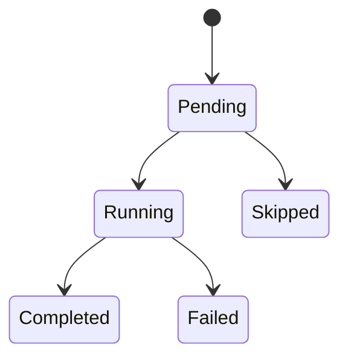

# Steps

A Step is an atomic unit of work within a Run. Each step is persisted in the database with its input, output, status, cost, duration, and token counts.

## Step kinds

| Kind | Method | Description |
|------|--------|-------------|
| Shell | `ctx.shell()` | Execute a shell command |
| Http | `ctx.http()` | Make an HTTP request |
| Agent | `ctx.agent()` | Call an AI agent (Claude, OpenAI, etc.) |
| Approval | `ctx.approval()` | Pause for human approval |
| Decision | `ctx.decision()` | Make a typed machine decision ([System One / Jev](decision.md)) |
| Workflow | `ctx.workflow()` | Start a sub-workflow |
| Custom | `ctx.operation()` | Run a custom [Operation](operations.md) |

## Shell steps

```rust,ignore
let output = ctx.shell("build", ShellConfig::new("cargo build")).await?;
if output.is_success() {
    // continue
}
```

## HTTP steps

```rust,ignore
let response = ctx.http("fetch-data", HttpConfig::get("https://api.example.com/data")).await?;
```

A shell step reads back through `stdout()`, `stderr()` and `exit_code()`, an
HTTP step through `status()` and `body()`. Files a shell step declares with
`.output("target/*.log")` are handed to later steps through a handle:
`build.artifact("build.log")?`, passed to `ShellConfig::input(&handle)` or
`ctx.get_artifact(&handle)`. A name the step did not declare fails with
`EngineError::ArtifactNotDeclared`.

## Agent steps

```rust,ignore
let result = ctx.agent("analyze", AgentStepConfig::new("Analyze this log file")).await?;
println!("{}", result.text());

#[derive(Deserialize, JsonSchema)]
struct Verdict { approved: bool }

// With `.output::<T>()` the step returns the `T` itself.
let verdict = ctx
    .agent("review", AgentStepConfig::new("Review the diff").max_turns(2).output::<Verdict>())
    .await?;
```

Tools are an enum: `.allow_tool(Tool::Bash)`, `Tool::Custom("mcp__server__tool".into())`
for anything else. Tools and structured output are mutually exclusive.

## Sub-workflow steps

A child declares its input type with `TypedWorkflow` and the parent passes that
type; see [WorkflowHandler](workflow-handler.md#typed-input-for-sub-workflows).

```rust,ignore
let child = ctx.workflow(&Collect, CollectInput { host: "db-1".into() }).await?;
println!("child run {}", child.run_id());
```

## Approval steps

```rust,ignore
ctx.approval("prod-gate", ApprovalConfig::new("Deploy to production?")).await?;
```

The run suspends on `AwaitingApproval` until a human answers. A gate can also
carry an SLA: a deadline persisted on the step and an escalation policy applied
when it expires.

```rust,ignore
use std::time::Duration;

ctx.approval(
    "prod-gate",
    ApprovalConfig::new("Deploy to production?")
        .assigned_to(Assignee::group("release-managers"))
        .with_deadline(Duration::from_secs(3600))
        .on_timeout(EscalationPolicy::AutoReject),
).await?;
```

| Field | Builder | Meaning |
|-------|---------|---------|
| `message` | `ApprovalConfig::new` | Prompt shown to reviewers |
| `assignee` | `assigned_to` | `Assignee::user` / `Assignee::group` expected to answer |
| `deadline_secs` | `with_deadline` / `with_deadline_secs` | SLA window, in seconds |
| `on_timeout` | `on_timeout` | `EscalationPolicy` applied when the deadline fires (defaults to `AutoReject`) |
| `timeout_seconds` | `with_timeout_seconds` | Legacy spelling of a deadline with an implicit `AutoReject` |
| `approvers` | `requiring` | `Approvers` computed by the handler: required approvals, allowed groups and an audit reason |

See [Approval Gates](approval-gates.md) for the full list of escalation policies,
where the remaining time surfaces, and how to
[require several approvers](approval-gates.md#requiring-several-approvers).

## Decision steps

A decision step asks a [`DecisionProvider`](decision.md) (System One / Jev) the
questions declared by a struct and returns that struct, filled with the answers.

```rust,ignore
#[derive(DecisionChoice)]
enum Team { Billing, Technical }

#[derive(DecisionAnswers)]
struct Routing {
    #[choice("Which team?")]
    team: Team,
}

let routing = ctx.decision(
    "triage",
    DecisionConfig::new("Payouts have been failing for 3 days")
        .answers::<Routing>()
        .escalate_below(0.7),
).await?;
if let Team::Billing = routing.team { /* .. */ }
```

Below the `escalate_below` confidence threshold, the run suspends for human approval;
on resume the stored answers are replayed as-is. See [Decisions](decision.md).

## Conditions

A handler branches with plain Rust `if`/`else`. That is invisible to the
[execution planner](../guides/execution-plan.md), which is why two helpers
exist to declare a branch explicitly.

`ctx.when(label, predicate)` deserializes the run input into the type the
closure takes and evaluates the predicate on it. It returns the predicate's
value, and the planner records it as `evaluated` together with the label you
gave the branch. The label is a name for the operator, never parsed:

```rust,ignore
#[derive(Deserialize, PartialEq)]
#[serde(rename_all = "lowercase")]
enum Env { Prod, Staging }

#[derive(Deserialize)]
struct DeployInput { env: Env }

if ctx.when("production run", |i: &DeployInput| i.env == Env::Prod).await? {
    ctx.shell("deploy-prod", ShellConfig::new("./deploy prod")).await?;
} else {
    ctx.skip("deploy-prod", "not a production run").await?;
}
```

A payload that does not match the type (`"env": "prd"`) fails with
`EngineError::Serialization` instead of silently taking the `else` branch.

`ctx.when_dynamic(label, value)` declares a branch whose value comes from
a previous step's output. It returns `value` unchanged; the planner records the
condition as `unevaluable`, because step outputs are synthetic while planning:

```rust,ignore
let build = ctx.shell("build", ShellConfig::new("cargo build")).await?;
if ctx.when_dynamic("build succeeded", build.is_success()) {
    ctx.shell("deploy", ShellConfig::new("./deploy")).await?;
}
```

Both helpers are optional: a plain `if` still runs exactly the same way. They
only make the branch legible to whoever reads the plan.

## Step status lifecycle

Steps follow this state machine:



Every step transition is recorded. Failed steps report their error in the step output.
