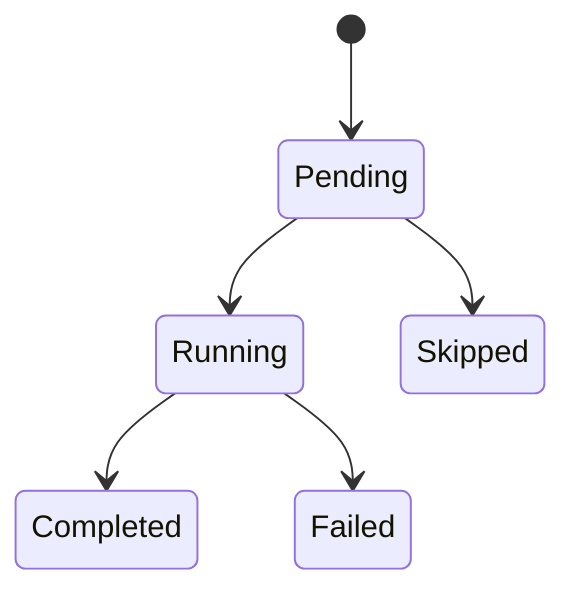

# Steps

A Step is an atomic unit of work within a Run. Each step is persisted in the database with its input, output, status, cost, duration, and token counts.

## Step kinds

| Kind | Method | Description |
|------|--------|-------------|
| Shell | `ctx.shell()` | Execute a shell command |
| Http | `ctx.http()` | Make an HTTP request |
| Agent | `ctx.agent()` | Call an AI agent (Claude, OpenAI, etc.) |
| Approval | `ctx.approval()` | Pause for human approval |
| Decision | `ctx.decision()` | Make a typed machine decision ([System One / Jev](decision.md)) |
| Workflow | `ctx.workflow()` | Start a sub-workflow |
| Custom | `ctx.operation()` | Run a custom [Operation](operations.md) |

## Shell steps

```rust,ignore
let output = ctx.shell("build", ShellConfig::new("cargo build")).await?;
if output.is_success() {
    // continue
}
```

## HTTP steps

```rust,ignore
let response = ctx.http("fetch-data", HttpConfig::get("https://api.example.com/data")).await?;
```

## Agent steps

```rust,ignore
let result = ctx.agent("analyze", AgentStepConfig::new("Analyze this log file")).await?;
```

## Decision steps

A decision step asks a [`DecisionProvider`](decision.md) (System One / Jev) a map of
typed questions about a state and returns typed answers with a calibrated confidence.

```rust,ignore
let out = ctx.decision(
    "triage",
    DecisionConfig::new("Payouts have been failing for 3 days")
        .choice("team", "Which team?", &["billing", "technical"])
        .escalate_below(0.7),
).await?;
let team = &out.choice("team")?.choice;
```

Below the `escalate_below` confidence threshold, the run suspends for human approval;
on resume the stored answers are replayed as-is. See [Decisions](decision.md).

## Step status lifecycle

Steps follow this state machine:



Every step transition is recorded. Failed steps report their error in the step output.
